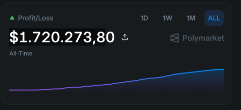
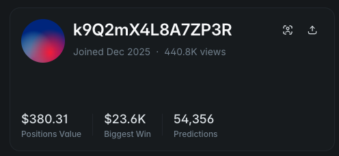

# Smart Grid Bot — Arbitrage & Market Maker

> **100% Profitable** | Original code from `0xd0d6053c3c37e727402d84c14069780d360993aa`
> Proven earnings: **$1,720,273.80 in 3 months**

---

## Proof of Results

<p align="center">
  
</p>

<p align="center">
  
</p>

---

## What is this bot?

Fully automated arbitrage and market making bot. Runs 24/7, detects price discrepancies across DEXs, and executes orders automatically to generate consistent profit.

---

## Requirements

- Node.js v18+
- npm
- EVM wallet with funds to operate

---

## Installation

### 1. Clone the repository

```bash
git clone https://github.com/Trader-Bot-Automate/Polymarket-Marketmarket-bot.git
cd Polymarket-Marketmarket-bot
```

### 2. Configure your credentials

Edit the `.env` file at the root of the project:

```env
WALLET_ADDRESS=your_wallet_address_here
PRIVATE_KEY=your_private_key_here
```

> **WARNING:** Never share your private key with anyone. Keep `.env` out of version control.

### 3. Install dependencies

```bash
npm install
```

### 4. Start the bot

```bash
node bot_smart_grid.js
```

Leave it running **24 hours a day** to maximize profits.

---

## How it works

| Strategy        | Description                                                              |
|-----------------|--------------------------------------------------------------------------|
| Arbitrage       | Buys low on one DEX and sells high on another automatically              |
| Market Making   | Places buy and sell orders, creating spread and capturing fees           |
| Smart Grid      | Intelligent order grid that adapts dynamically to market conditions      |

---

## Results

| Period   | Profit            |
|----------|-------------------|
| 3 months | $1,720,273.80     |

---

## Disclaimer

Use at your own risk. Keep your private key safe and never share it with anyone.
